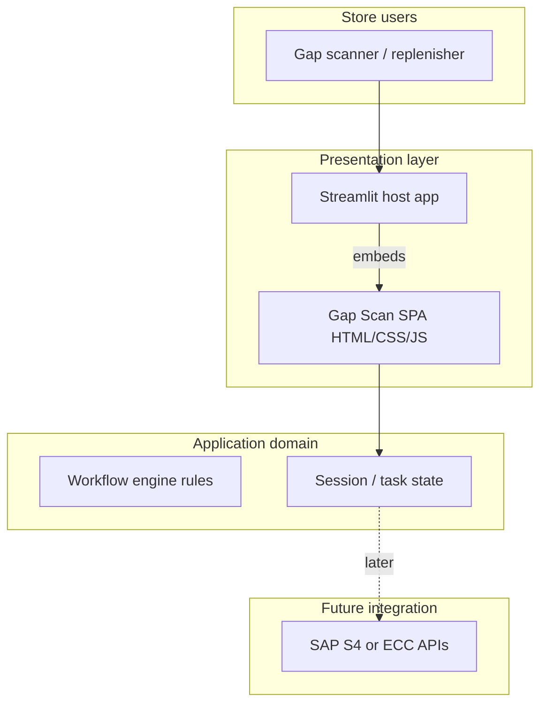

# Replenishment application — architecture

This document describes the **logical architecture** of the Replenishment / Gap Scan product, how the current **HTML prototype** fits in, and how it is **hosted on Streamlit** for demos and iterative delivery.

---

## 1. Goals

| Goal | Description |
|------|-------------|
| **Task clarity** | Guide store users from gap identification → shelf removal recording → floor fill (Close Gap) → completion. |
| **SAP-aligned UX** | Shell, density, and patterns consistent with SAP Fiori (see `SAP-Fiori-components-and-designs.md`). |
| **Deployable demo** | Run in **Streamlit** (Streamlit Community Cloud or private) without a separate static host for the prototype phase. |
| **Path to production** | Replace in-memory prototype state with SAP APIs (OData/BAPI) and optional native Streamlit or Fiori UI. |

---

## 2. High-level system context



- **Today:** Business rules and state live **in the browser** (`app.js`) inside an **iframe** rendered by Streamlit (`components.html`).  
- **Tomorrow:** Streamlit (or Fiori) calls **backend services**; rules move server-side; the embedded SPA can be retired or reduced to a thin client.

---

## 3. Logical modules (domain)

| Module | Responsibility | Prototype surface |
|--------|----------------|-------------------|
| **Documents** | List work objects: Create New, open WOs, completed WOs. | Master list in `index.html` / `renderMaster`. |
| **Gap index** | Show gap lines, SOH/SOO hints, select articles, spawn WO. | Create New detail / `renderCreateDetail`. |
| **Replenish** | Per-line location/SOH, Remove Article, BIN / Article Not Found, progress. | `renderReplenishmentDetail`, modals. |
| **Close Gap** | Eligible GTIN scan, fill status, quotas, task completion modal. | `renderMerchandising`, fill modal. |
| **Complete** | Read-only Close Gap table + exceptions, summary KPIs, LOE. | `renderCloseGapReadOnly`, `closeGapRows`. |

Rules and field-level behaviour are documented in [ReplenishmentWorkflow.md](./ReplenishmentWorkflow.md).

---

## 4. Application state model (conceptual)

```
Document (WO or landing)
├── id, status, closedLabel (display overrides in list)
├── replenishment?
│   ├── lines[] (article, gtin, removed, exception, removedMeta, …)
│   └── readOnly
├── merchandising? (active Close Gap only)
│   └── rows[] (articleName, quantity, from, to, status)
├── closeGapRows[] (persisted snapshot at complete)
├── taskStartedAtMs / taskCompletedAtMs / loeDisplay
└── isLanding (Create New)
```

- **Prototype:** all of the above is **in-memory** in `app.js` (`documents`, `selectedId`).  
- **Target:** persist WO header and lines in SAP; use Streamlit `st.session_state` or a small API as a façade.

---

## 5. Streamlit deployment architecture

### 5.1 Pattern: embedded SPA (current)

```
streamlit_app/app.py
    │
    ├─ reads ../prototype/gap-scan/index.html, styles.css, app.js
    ├─ inlines CSS + JS (+ optional logo as data URI)
    └─ streamlit.components.v1.html(..., height=…)
```

**Why inline?** `components.html` uses a **srcdoc** iframe; relative URLs (`styles.css`, `app.js`, images) do not resolve to your repo. Bundling into one HTML string keeps a **single deployable unit** without a separate static file server.

**Trade-offs**

| Pros | Cons |
|------|------|
| One `streamlit run`; works on Streamlit Cloud | Large payload (full JS/CSS each run) |
| No change to prototype workflow for demos | Harder to cache; debug inside iframe |
| Fast path to stakeholder demos | Production should use APIs + slimmer UI |

### 5.2 Future: Streamlit-native pages

Replace the iframe with:

- `st.session_state` mirroring `documents` / `selectedId`
- `st.data_editor`, forms, and columns for each step
- **Pyodide / custom component** only if you must keep identical HTML

This is the recommended direction once SAP contracts are defined.

### 5.4 On‑prem (enterprise) deployment options

If you need to run this product **on‑prem** (inside a corporate network), the same architecture can be hosted without Streamlit Community Cloud:

- **Option A — On‑prem Streamlit**: deploy `streamlit_app/app.py` to an internal VM / Kubernetes / SAP BTP (Kyma)–style runtime; terminate TLS at your ingress; integrate SSO upstream.
- **Option B — Static SPA hosting**: serve `prototype/gap-scan/` from an internal web server (e.g. Nginx/IIS). (If you keep the “inline bundle” approach, you don’t need a static server; if you switch to static hosting, you can load `index.html` directly.)
- **Option C — Future production**: replace in-memory state with SAP APIs and ship a proper Fiori/React frontend; Streamlit becomes optional.

### 5.3 Repository layout

```
Replenishment App V2/
├── Docs/
│   ├── ReplenishmentArchitecture.md   ← this file
│   ├── ReplenishmentWorkflow.md
│   └── …
├── prototype/gap-scan/                ← source SPA (also openable as static files)
├── streamlit_app/
│   ├── app.py                         ← Streamlit entry
│   ├── requirements.txt
│   └── .streamlit/config.toml
```

---

## 6. Security & compliance (outline)

| Topic | Prototype | Production |
|-------|-----------|------------|
| **Auth** | None | Corporate IdP, SAP auth |
| **PII / store data** | Mock | Encrypt in transit; SAP authorisation |
| **Audit** | None | Log removals, exceptions, Close Gap saves |

---

## 7. Observability & operations

| Concern | Prototype | Target |
|---------|-----------|--------|
| **Errors** | Browser console | Central logging (e.g. SAP Application Log) |
| **Metrics** | None | Task duration, exception rate, fill accuracy |

---

## 8. Evolution roadmap

1. **Now:** Streamlit + embedded SPA for demos and UX sign-off.  
2. **Next:** Extract **state schema** and **API contracts** (WO create, line update, Close Gap post).  
3. **Then:** Implement **Streamlit-native** or **Fiori** UI against SAP; retire or shrink embedded bundle.  
4. **Optional:** Mobile-optimised subset (scan-first) on the same APIs.

---

## 9. Running locally

```bash
cd "Replenishment App V2/streamlit_app"
python -m venv .venv
source .venv/bin/activate   # Windows: .venv\Scripts\activate
pip install -r requirements.txt
streamlit run app.py
```

**Streamlit Community Cloud:** set main file to `streamlit_app/app.py` and Python 3.10+.

---

*This architecture is descriptive of the repository as implemented; adjust integration boxes when SAP endpoints are chosen.*
