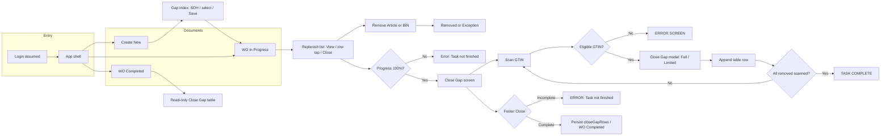

# Replenishment app — end-to-end wireframe

Low-fidelity **text wireframes** for the **Gap Scan / Replenishment** prototype (`prototype/gap-scan/`). Layout follows a **SAP Fiori–style** shell: top bar, **Documents List** (master) left, **detail** right, **footer** actions.  
Behavioural detail: see [ReplenishmentWorkflow.md](./ReplenishmentWorkflow.md).

---

## Legend

| Symbol | Meaning |
|--------|---------|
| `[ ]` | Checkbox |
| `(...)` | Button |
| `|...|` | Input / scan field |
| `===` | Modal / overlay boundary |
| `→` | Primary flow |

---

## 1. Global app shell (all steps)

```
┌──────────────────────────────────────────────────────────────────────────────┐
│  [←]  [Logo]  Replenishment App ▾                    [🔍]  [Profile]          │  ← Shell bar
├──────────────────┬───────────────────────────────────────────────────────────┤
│ Documents List   │  Detail Page                                                │
│                  │                                                             │
│  | Search by ID  |  ┌─────────────────────────────────────────────────────┐   │
│  [↻] [filter]    │  │  <Screen-specific title & body>                       │   │
│                  │  └─────────────────────────────────────────────────────┘   │
│  ┌────────────┐  │                                                             │
│  │ Create New │  │                                                             │
│  └────────────┘  │                                                             │
│  ┌────────────┐  │                                                             │
│  │ WO00…12    │  │                                                             │
│  │ Completed  │  │                                                             │
│  └────────────┘  │                                                             │
│  ┌────────────┐  │                                                             │
│  │ WO00…13    │  │                                                             │
│  │ In Progr…  │  │                                                             │
│  └────────────┘  │                                                             │
├──────────────────┴───────────────────────────────────────────────────────────┤
│  M01 - Germiston Main Store          [ action buttons — see per screen ]      │  ← Footer
└──────────────────────────────────────────────────────────────────────────────┘
```

---

## 2. Create New (gap index)

**Footer:** `( Select All )` `( Save )`

```
Detail area
────────────────────────────────────────
  Create New

  • Number of Articles :  n
  • Articles with no stock :  n
  • +12 Hours Gaps :  n

  | Search by Article Name … |  [↻] [🔍] [filter]

  ┌──────────┬─────────────────────────────┬─────────────────┬───┐
  │ Doc /    │ Product name                │ SOH (+ SOO/     │[ ]│
  │ time     │ GTIN (under name)           │  Created if 0)  │   │
  ├──────────┼─────────────────────────────┼─────────────────┼───┤
  │ …        │ FANTA …                     │ SOH: 203        │[ ]│
  │ …        │ …                           │ SOO / Created…  │   │  ← when SOH = 0
  └──────────┴─────────────────────────────┴─────────────────┴───┘
```

**Selection rule:** checkboxes (and Select All / Save) are **hidden/disabled until the user applies the Articles filter at least once**.

---

## 3. Work order in progress — gap replenishment (`WO00000013`)

**Footer:** `( Close )`  
**Summary:** Number of Articles, +30 min assigned (if shown), **Progress : n%**

```
Detail area
────────────────────────────────────────
  WO00000013

  • … summary bullets …

  | Search by Article Name … |  [↻] [🔍] [filter]

  ┌──────────────────────────────────────────────────────────────────┐
  │  Article          │  Location:SOH                    │  (action) │
  ├──────────────────────────────────────────────────────────────────┤
  │  Name              │  S001: 203                         │  View     │
  │  GTIN: …           │  Z1-… : 501                        │           │
  ├──────────────────────────────────────────────────────────────────┤
  │  … (active rows)   │  …                                 │  View     │
  ├──────────────────────────────────────────────────────────────────┤
  │  … (grey)          │  …                                 │ Removed   │  ← after Remove Article
  │  …                 │                                    │ (green)   │
  ├──────────────────────────────────────────────────────────────────┤
  │  … (grey)          │  …                                 │ Exception │  ← after BIN / Not Found
  │  …                 │                                    │ (red)     │
  └──────────────────────────────────────────────────────────────────┘

  Tap row (not View) → Remove Article modal.
  Tap View → Articles Details modal.
```

---

## 4. Modal — Articles Details (View)

```
        ╔══════════════════════════════════════╗
        ║  Articles Details                    ║
        ╠══════════════════════════════════════╣
        ║  PRODUCT TITLE                       ║
        ║  Article Number: …   GTIN: …          ║
        ║                                      ║
        ║  Stock On Hand                       ║
        ║    Loc: qty • BB: DD/MM              ║
        ║                                      ║
        ║  Stock on order                      ║
        ║    Last order / Qty / EDD            ║
        ╠══════════════════════════════════════╣
        ║                        ( Close )     ║
        ╚══════════════════════════════════════╝
```

---

## 5. Modal — Remove Article

```
        ╔══════════════════════════════════════╗
        ║  Remove Article                      ║
        ╠══════════════════════════════════════╣
        ║  Scan GTIN:                          ║
        ║  |………………………………………………|              ║
        ║  Enter Quantity:                     ║
        ║  |………………………………………………|              ║
        ╠══════════════════════════════════════╣
        ║ [🗑 BIN]          ( Cancel ) ( Save )║  ← BIN left; Save primary right
        ╚══════════════════════════════════════╝
```

---

## 6. Modal — Article Not Found (after BIN)

```
        ╔══════════════════════════════════════╗
        ║  Article Not Found                   ║
        ╠══════════════════════════════════════╣
        ║  Reason (radio)                      ║
        ║    ( ) Stock not found               ║
        ║    ( ) Damaged Stock                 ║
        ║    ( ) Exp Stock                     ║
        ║                                      ║
        ║  Scan / Enter Location  (if Damaged/Exp)║
        ║  |………………………………………………|              ║
        ╠══════════════════════════════════════║
        ║              ( Cancel )    ( Save )  ║
        ╚══════════════════════════════════════╝
```

---

## 7. Modal — Error (task not finished — replenishment step)

```
        ╔══════════════════════════════════════╗
        ║  Error                               ║
        ╠══════════════════════════════════════╣
        ║  Task not finished                   ║
        ╠══════════════════════════════════════╣
        ║                          ( Close ) ║
        ╚══════════════════════════════════════╝
```

---

## 8. Close Gap — main screen (active)

**Footer:** `( Close )` — validates all removed articles scanned before complete.

```
Detail area
────────────────────────────────────────
  WO00000013 — Close Gap

  • Scan GTIN to close gaps

  | Scan GTIN … |

  ┌──────────────┬───────────┬──────────┬──────────────┬────────────────┐
  │ Article:     │ Quantity: │ From:    │ To :         │ Status:        │
  ├──────────────┼───────────┼──────────┼──────────────┼────────────────┤
  │ FANTA …      │ 100       │ <Remove  │ Aisle 1 |    │ Filled in full │
  │              │           │  loc>    │ Shelf 1      │ / Limited stock│
  └──────────────┴───────────┴──────────┴──────────────┴────────────────┘
```

---

## 9. Modal — Close Gap (after GTIN scan + Enter)

```
        ╔══════════════════════════════════════╗
        ║  Close Gap                           ║
        ╠══════════════════════════════════════╣
        ║  Article : FANTA GRAPE 2LT : Each    ║
        ║  Close Gap : Aisle 1 | Shelf 1      ║
        ║                                      ║
        ║  ( ) Filled in full                  ║
        ║  ( ) Limited stock                   ║
        ╠══════════════════════════════════════╣
        ║              ( Cancel )    ( Save )  ║
        ╚══════════════════════════════════════╝
```

---

## 10. Modal — ERROR SCREEN (GTIN not for this task)

```
        ╔══════════════════════════════════════╗
        ║  ERROR SCREEN                        ║
        ╠══════════════════════════════════════╣
        ║  Article not for this task           ║
        ╠══════════════════════════════════════╣
        ║                          ( Close ) ║
        ╚══════════════════════════════════════╝
```

---

## 11. Modal — TASK COMPLETE

```
        ╔══════════════════════════════════════╗
        ║  TASK COMPLETE                       ║
        ╠══════════════════════════════════════╣
        ║  All articles for this task have     ║
        ║  been scanned.                       ║
        ╠══════════════════════════════════════╣
        ║                          ( Close ) ║
        ╚══════════════════════════════════════╝
```

---

## 12. Modal — ERROR (Close Gap footer — not all scanned)

```
        ╔══════════════════════════════════════╗
        ║  ERROR                               ║
        ╠══════════════════════════════════════╣
        ║  Task not finished                   ║
        ╠══════════════════════════════════════╣
        ║                          ( Close ) ║
        ╚══════════════════════════════════════╝
```

---

## 13. Completed work order — read-only Close Gap

**Footer:** no task actions (Create / Close groups hidden for completed WO).

```
Detail area
────────────────────────────────────────
  WO00000012 — Close Gap

  • Task completed

  ┌──────────────┬───────────┬──────────┬──────────────┬────────────────┐
  │ Article:     │ Quantity: │ From:    │ To :         │ Status:        │
  ├──────────────┼───────────┼──────────┼──────────────┼────────────────┤
  │ (snapshot    │ 100       │ …        │ Aisle 1 |    │ Filled in full │
  │  rows only)  │           │          │ Shelf 1      │ / Limited …    │
  └──────────────┴───────────┴──────────┴──────────────┴────────────────┘

  No scan field. No buttons in table. Same columns as §8.
```

---

## 14. End-to-end journey (flow)



---

## 15. Screen index (quick reference)

| # | Screen / overlay | When |
|---|------------------|------|
| 1 | App shell | Always |
| 2 | Create New | Landing / gap index |
| 3 | WO in progress — replenish list | After Save from Create New |
| 4 | Articles Details | View on replenish row |
| 5 | Remove Article | Tap replenish row |
| 6 | Article Not Found | BIN on Remove Article |
| 7 | Error (replenish Close) | Close before 100% progress |
| 8 | Close Gap main | After replenish Close at 100% |
| 9 | Close Gap modal | Valid GTIN scan |
| 10 | ERROR SCREEN | Invalid GTIN on Close Gap |
| 11 | TASK COMPLETE | All Close Gap scans done |
| 12 | ERROR (Close Gap footer) | Close before all scans saved |
| 13 | Completed — Close Gap read-only | Completed WO selected |

---

*Aligned with prototype: `prototype/gap-scan/` and [ReplenishmentWorkflow.md](./ReplenishmentWorkflow.md).*
